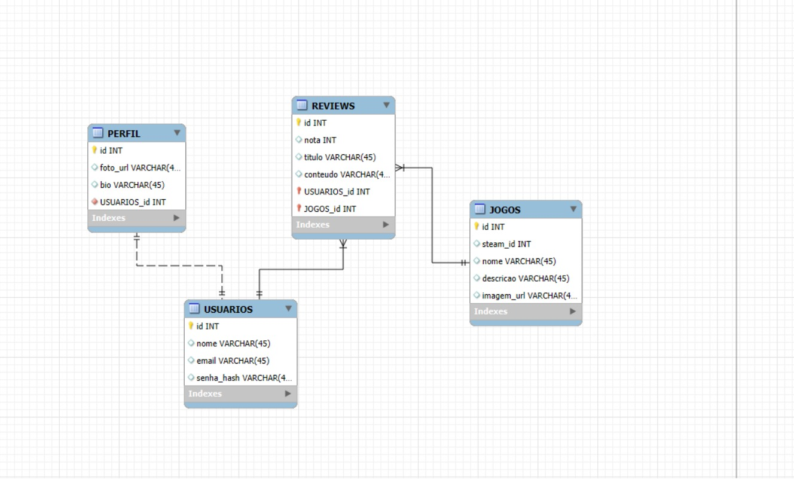

# SteamDex
## Visão Geral do Projeto

### Problema que a plataforma resolve
Atualmente, muitos jogadores utilizam diferentes plataformas para acompanhar e avaliar jogos e compartilhar opiniões, o que acaba fragmentando a experiência. Além disso, nem sempre há um espaço focado em críticas mais detalhadas e na interação entre usuários com gostos semelhantes.

O Steamdex surge para agrupar essas funcionalidades em um único ambiente, fazendo com que usuários possam registrar, avaliar e discutir jogos em uma comunidade de jogadores.

### Público-alvo

#### O Steamdex é voltado para:

- Jogadores que desejam registrar suas experiências com jogos
- Pessoas interessadas em compartilhar opiniões e críticas
- Usuários que gostam de descobrir novos jogos através de recomendações e listas
- Comunidades que querem discutir jogos e trocar ideias

### Principais funcionalidades

- Cadastro e autenticação de usuários
- Listagem e busca de jogos (integrada com a API da Steam)
- Sistema de avaliação (notas)
- Criação de reviews
- Criação de listas personalizadas de jogos

## Modelagem de dados


## Estrutura do Projeto
```bash
STEAMDEX/
 |_ backend/
    |_ src/                                                # Todo o código estará contido nessa pasta
       |_ app/                                             # Pasta para rotas da aplicação
          |_ auth/                                         # Rotas de autenticação
          |_ api.py
       |_ models/                                          # Modelo do banco de dados
       |_ main.py
    |_ requirements.txt                                    # Dependências do projeto

 |_ frontend/
    |_ src/
       |_ assets/                                          # Imagens
       |_ components/                                      # Componentes reutilizáveis
       |_ styles/                                          # Estilos globais
    |_ static/

 |_ README.md
```

## Definição dos Endpoints

| Método (nome) | Rota                  | Descrição                       |
| ------------- | --------------------- | ------------------------------- |
| register      | `POST /auth/register` | Cria um novo usuário            |
| login         | `POST /auth/login`    | Autentica usuário e retorna JWT |
| refresh_token | `POST /auth/refresh`  | Gera novo access token          |
| perfil | `GET /users/me` | Retorna dados do usuário logado |
| atualizar_perfil | `PATCH /users/me` | Atualiza dados do perfil (bio, foto) |
| listar_jogos | `GET /games` | Lista todos os jogos |
| get_jogo | `GET /games/{game_id}` | Detalha um jogo específico |
| buscar_jogo | `GET /games/search?q=` | Busca jogos por nome |
| sync_jogo | `POST /games/sync/{steam_id}` | Sincroniza jogo com API da Steam |
| criar_review | `POST /reviews` | Cria uma review de um jogo |
| listar_reviews | `GET /reviews` | Lista todas as reviews |
| listar_reviews_jogo | `GET /games/{game_id}/reviews` | Lista reviews de um jogo |
| listar_reviews_usuario | `GET /users/{user_id}/reviews` | Lista reviews de um usuário |
| get_review | `GET /reviews/{review_id}` | Detalha uma review |
| atualizar_review | `PATCH /reviews/{review_id}` | Atualiza uma review |
| deletar_review | `DELETE /reviews/{review_id}` | Remove uma review |
| listar_usuarios | `GET /admin/users` | Lista usuários (admin) |
| get_user | `GET /admin/users/{user_id}` | Detalha usuário (admin) |
| deactivate_user | `PATCH /admin/users/{user_id}/deactivate` | Desativa usuário (admin) |


## Requisitos Funcionais, Não Funcionais e Regras de Negócio
### Requisitos Funcionais
- RF.1: O sistema deve permitir o cadastro de usuários.
- RF.2: O sistema deve permitir o login de usuários previamente cadastrados.
- RF.3: O sistema deve permitir a atualização dos dados do perfil do usuário (bio e foto).
- RF.4: O sistema deve permitir a listagem de jogos cadastrados.
- RF.5: O sistema deve permitir a busca de jogos por nome.
- RF.6: O sistema deve exibir os detalhes de um jogo específico.
- RF.7: O sistema deve permitir a sincronização de jogos com a API da Steam.
- RF.8: O sistema deve permitir que usuários criem reviews de jogos.
- RF.9: O sistema deve permitir que usuários editem suas próprias reviews.
- RF.10: O sistema deve permitir que usuários excluam suas próprias reviews.
- RF.11: O sistema deve listar reviews de um jogo específico.
- RF.12: O sistema deve listar reviews feitas por um usuário.
- RF.13: O sistema deve permitir que administradores listem usuários cadastrados.
- RF.14: O sistema deve permitir que administradores visualizem detalhes de usuários.
- RF.15: O sistema deve permitir que administradores desativem usuários.

### Requisitos Não Funcionais
- RNF.1: O sistema deve ter tempo de resposta inferior a 500ms para operações comuns.
- RNF.2: O sistema deve ser acessível via navegador web moderno (Chrome, Edge e Firefox).
- RNF.3: O sistema deve garantir a segurança dos dados dos usuários (criptografia de senha).
- RNF.4: O sistema deve utilizar autenticação baseada em JWT.
- RNF.5: O sistema deve estar disponível 24 horas por dia.
- RNF.6: O sistema deve possuir interface responsiva e intuitiva.
- RNF.7: O backend deve ser estruturado de forma modular para facilitar manutenção.
- RNF.8: O sistema deve ser executável em ambiente containerizado (Docker).

### Regras de Negócio

- RN.1: O email do usuário deve ser único no sistema.
- RN.2: O usuário não poderá alterar seu email após o cadastro.
- RN.3: Um usuário pode criar apenas uma review por jogo.
- RN.4: A nota de uma review deve estar em um intervalo válido (ex: 0 a 10).
- RN.5: Apenas o autor pode editar ou excluir sua review.
- RN.6: Um jogo não pode ser duplicado no sistema (baseado no steam_id).
- RN.7: Apenas usuários autenticados podem criar, editar ou excluir reviews.
- RN.8: Usuários desativados não podem realizar login no sistema.
- RN.9: Apenas administradores podem acessar rotas administrativas.
- RN.10: A sincronização com a API da Steam deve evitar dados inconsistentes ou duplicados.
- RN.11: O perfil do usuário só pode ser editado pelo próprio usuário autenticado.